В этом задании  необходимо создать приложение "TODO список".

Стек технологий: Spring boot, Thymeleaf, Bootstrap, Hibernate, PostgreSql 

Проект представляет из себя список дел, которые можно удалить, редактировать и выполнить

Запуск проекта 
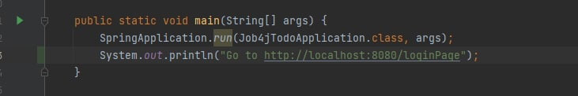
Переходим по ссылке для авторизации
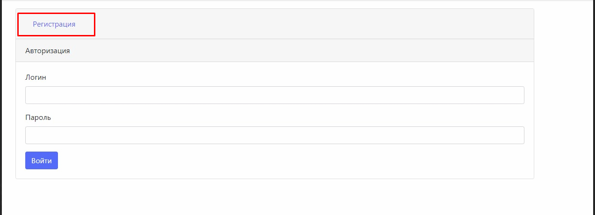
Регистрируем новый аккаунт
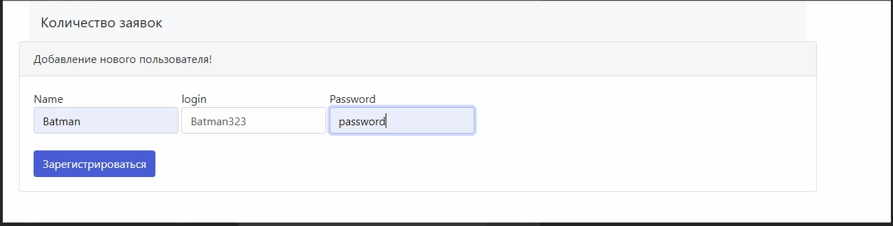
Логинемся
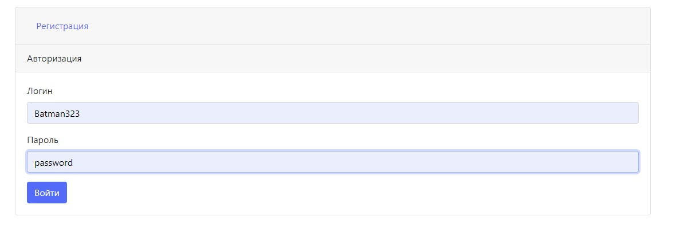
Мы имеем список всех дел которые когда либо были созданы

Мы можем добавить новую задачу после
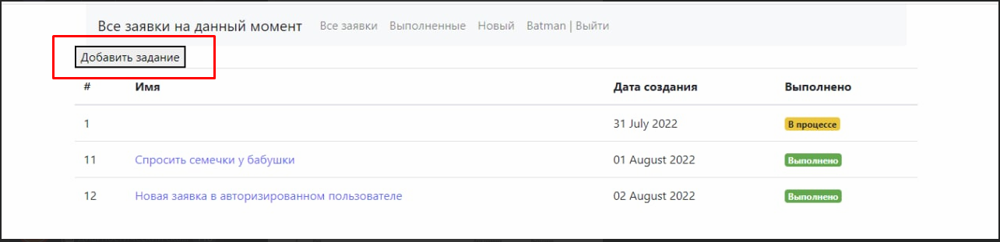
После чего перейти по ссылке
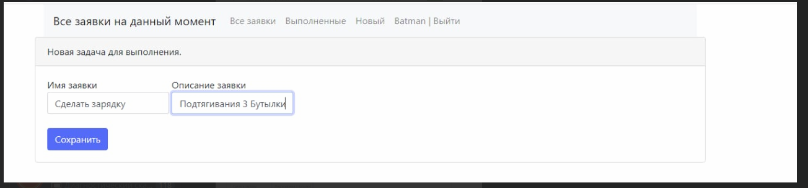
И увидеть полное описание данного задания
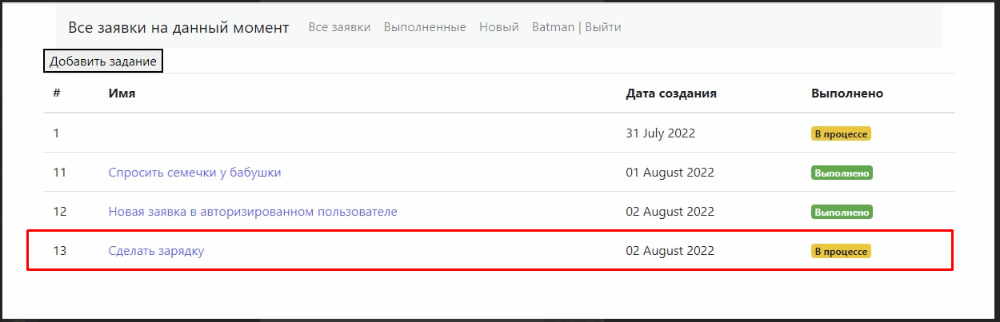
Тут присутствуют 3 кнопки Выполнено Удалить Отредактировано 
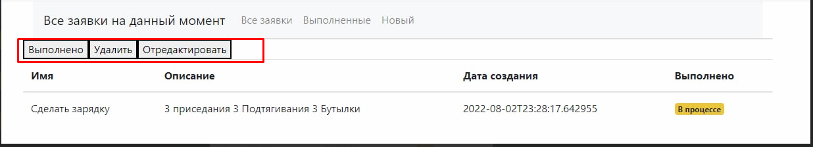
При нажатие на выполнено нас перекидывает на страницу. Где мы просто подтверждаем, что задание было выполнено
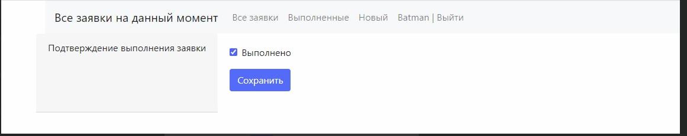
После чего мы видим что задание было выполнено

При нажатие на редактирования задания, при условии, что оно было выполнено. Выполнение сбрасывается.
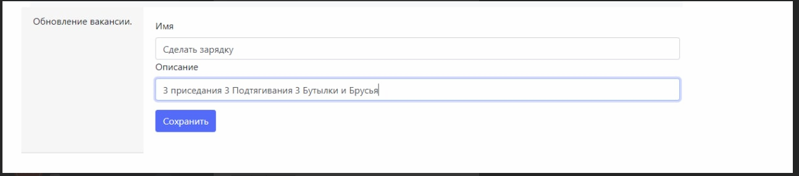
Как видим оно сбросилось
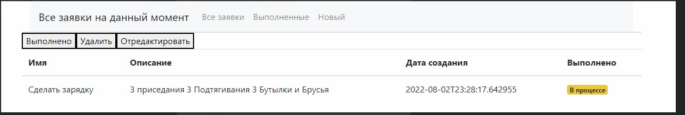
При нажатие на удаление дело удаляется
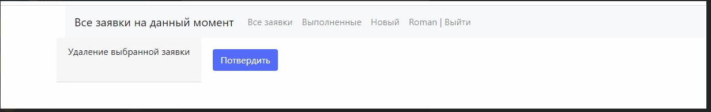
